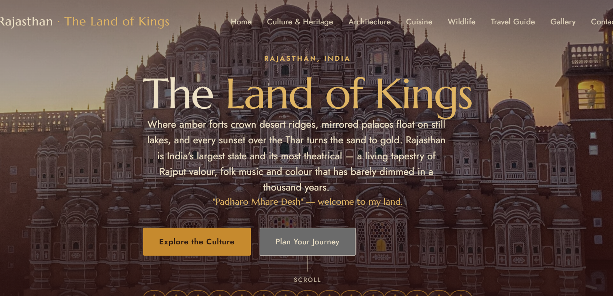
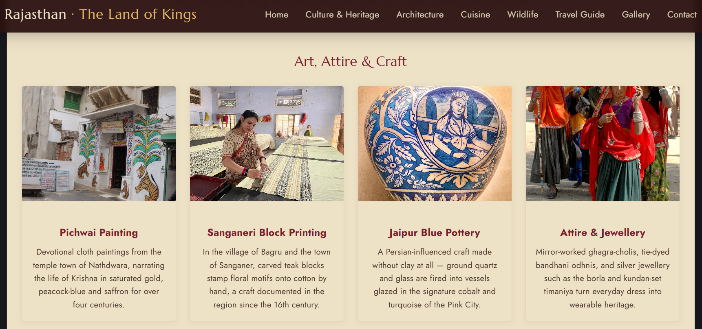
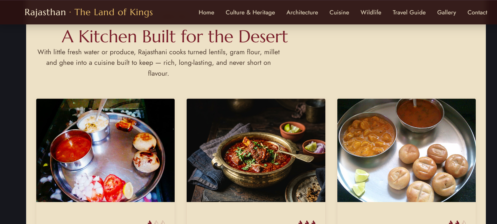

# Rajasthan Tourism Web Application
A vibrant, fully responsive single-page web application dedicated to showcasing the rich cultural heritage, architecture, cuisine, and wildlife of Rajasthan, India. Built using React 19 and bundled with Vite for optimized performance.

## 📸 Screenshots

### Desktop View


### Mobile Responsive Menu & City Filter
<p align="flex-start">
  
  
</p>

---

## 🌟 Features
* Interactive City Exploration: Filter and view historical landmarks based on major cities like Jaipur, Udaipur, Jodhpur, and Jaisalmer.

* Immersive Cultural Highlights: Showcases traditional dances (Ghoomar, Kalbeliya), block printing crafts, and regional festivals.

* Gastronomy & Wildlife Modules: Deep dives into traditional Rajasthani cuisine (Dal Baati Churma, Laal Maas) and protected wildlife sanctuaries.

* Curated Travel Guides: Interactive travel planners highlighting ideal visiting seasons and curated regional travel circuits.

* Media Gallery Lightbox: A built-in modal utility to expand and browse high-quality images of landmark destinations.

* Responsive Mobile Experience: Built with a fully fluid layout, sticky navigation header, and a slide-out mobile drawer menu.

## 🛠️ Tech Stack
* Framework: React 19

* Build Tool: Vite

* Icons: Lucide React

* Styling: Custom component-scoped global CSS layout injected with regional CSS variables (--sand, --maroon, --gold, and --indigo).

* Fonts: Marcellus (Headings) and Jost (Body text).

## 📁 Project Structure
```
jha-2022/rajasthan/
├── public/
│   ├── images/          # Local static images (dunes, palaces, attire, etc.)
│   └── favicon.svg
├── src/
│   ├── components/
│   │   └── RajasthanWebsite.jsx  # Main centralized shell layout & subviews
│   ├── data/
│   │   └── constants.js         # Core copy/data arrays for all modules
│   ├── App.jsx
│   └── main.jsx
├── package.json
└── vite.config.js

```


## 🚀 Getting Started
### Prerequisites
Ensure you have Node.js installed on your system.

### Installation
1.Clone the repository or navigate to the project directory:

```cd jha-2022/rajasthan```


2. Install the necessary dependencies:

```
bash
npm install
```

### Development
To launch the hot-reloading local development server:

```
Bash
npm run dev
```

Open the provided URL (typically http://localhost:5173) in your web browser.

Build
To compile the application into static assets for production deployment:

```
Bash
npm run build
```

The output files will be generated in the dist/ directory.

## ⚙️ Configuration & Content Customization
All copy, city sections, navigation items, image routes, and descriptions can be changed directly without editing the components. To customize the site's content, update the object export variables inside:

```
src/data/constants.js
```
